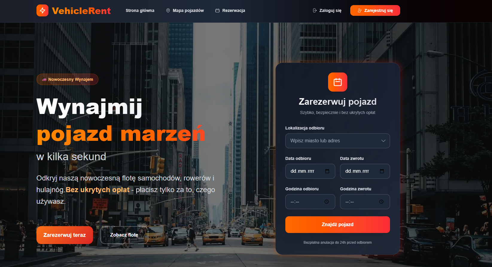

# 🚗 VehicleRent - Platforma Wynajmu Pojazdów

**Profesjonalna platforma do wynajmu samochodów, rowerów i hulajnóg** - Nowoczesna aplikacja webowa gotowa do wdrożenia jako produkt komercyjny

Zaawansowany, pełnofunkcjonalny system wynajmu pojazdów zbudowany w **Next.js 16** z **React 19**, **TypeScript**, **Prisma** i **PostgreSQL**. Aplikacja oferuje kompletne rozwiązanie dla firm wynajmujących pojazdy, umożliwiając zarządzanie flotą, rezerwacjami i klientami.

---

## 📸 Zrzuty Ekranu

### Strona Główna - System Rezerwacji



*Nowoczesny interfejs z formularzem rezerwacji i hero section*

---

## 👨‍💻 Autor i Twórca

**Tomasz Chromy** - jedyny twórca i pomysłodawca

- 🌐 Strona: [tomaszchromy.com](https://tomaszchromy.com)
- 📧 Email: tomasz.chromy@outlook.com
- 💼 GitHub: [TomaszChromy](https://github.com/TomaszChromy)

**Copyright © 2024-2025 Tomasz Chromy. Wszelkie prawa zastrzeżone.**

---

## 🌟 Główne Funkcje

### 🚙 Zarządzanie Flotą Pojazdów

- **Katalog pojazdów** - Samochody, rowery, hulajnogi elektryczne
- **Szczegółowe informacje** - Marka, model, rok, cena, dostępność
- **Galeria zdjęć** - Wielokrotne zdjęcia dla każdego pojazdu
- **Lokalizacje** - 6 miast w Polsce (Warszawa, Kraków, Gdańsk, Wrocław, Poznań, Katowice)
- **Status dostępności** - Real-time tracking dostępności pojazdów
- **Kategorie** - Filtrowanie po typie, cenie, lokalizacji

### 📅 System Rezerwacji

- **Interaktywny kalendarz** - Wybór dat rozpoczęcia i zakończenia wynajmu
- **Wybór lokalizacji** - Odbiór i zwrot w różnych lokalizacjach
- **Wybór czasu** - Precyzyjne określenie godzin odbioru/zwrotu
- **Kalkulacja ceny** - Automatyczne obliczanie kosztów wynajmu
- **Potwierdzenie rezerwacji** - Email z potwierdzeniem i szczegółami
- **Historia rezerwacji** - Pełna historia dla użytkowników

### 🗺️ Interaktywna Mapa

- **Google Maps API** - Wizualizacja lokalizacji pojazdów
- **Markery pojazdów** - Różne ikony dla różnych typów
- **Info windows** - Szczegóły pojazdu po kliknięciu
- **Filtrowanie** - Pokazywanie tylko dostępnych pojazdów
- **Geolokalizacja** - Znajdź pojazdy w pobliżu

### 🔐 System Użytkowników

- **Rejestracja i logowanie** - NextAuth.js z JWT
- **Role użytkowników** - CLIENT, MANAGER, ADMIN
- **Profil użytkownika** - Edycja danych osobowych
- **Historia rezerwacji** - Przegląd wszystkich rezerwacji
- **Zarządzanie kontem** - Zmiana hasła, ustawienia

### 👨‍💼 Panel Administracyjny

- **Dashboard** - Statystyki i kluczowe metryki
- **Zarządzanie pojazdami** - CRUD operations
- **Zarządzanie rezerwacjami** - Przegląd i edycja
- **Zarządzanie użytkownikami** - Role i uprawnienia
- **Raporty** - Analityka przychodów i wykorzystania floty

### 💳 Plany Cenowe

- **Basic Plan** - Podstawowy dostęp (99 PLN/miesiąc)
- **Premium Plan** - Rozszerzone funkcje (199 PLN/miesiąc)
- **Enterprise Plan** - Pełen dostęp (399 PLN/miesiąc)
- **Zarządzanie subskrypcjami** - Upgrade/downgrade planów

### ⭐ System Recenzji

- **Oceny pojazdów** - 1-5 gwiazdek
- **Komentarze** - Opinie użytkowników
- **Moderacja** - Zarządzanie recenzjami przez adminów
- **Średnia ocena** - Automatyczne obliczanie

---

## 🛠️ Technologie

### Frontend

- **Next.js 16** - React framework z App Router i Turbopack
- **React 19.2** - Najnowsza wersja z Concurrent Features
- **TypeScript 5** - Statyczne typowanie dla lepszej jakości kodu
- **Tailwind CSS 4** - Utility-first CSS framework
- **Headless UI** - Accessible UI components
- **Heroicons** - Beautiful hand-crafted SVG icons
- **Lucide React** - Nowoczesne ikony SVG

### Backend

- **Next.js API Routes** - Serverless functions
- **Prisma ORM 6.19** - Type-safe database access layer
- **PostgreSQL** - Relacyjna baza danych (SQLite w dev)
- **NextAuth.js 4.24** - Authentication dla Next.js
- **bcryptjs** - Bezpieczne hashowanie haseł
- **JWT** - JSON Web Tokens dla autentykacji

### Integracje

- **Google Maps API** - Mapy i geolokalizacja
- **@googlemaps/js-api-loader** - Loader dla Google Maps

### Narzędzia Deweloperskie

- **ESLint 9** - Linting kodu
- **TypeScript** - Type checking
- **Prisma Studio** - GUI dla bazy danych
- **tsx** - TypeScript execution dla seedów

---

## 📋 Wymagania Systemowe

### Minimalne

- **Node.js**: 18.0+
- **PostgreSQL**: 14.0+ (lub SQLite dla dev)
- **RAM**: 2GB
- **Dysk**: 1GB wolnego miejsca
- **Przeglądarka**: Chrome 90+, Firefox 88+, Safari 14+

### Zalecane

- **Node.js**: 20.0+
- **PostgreSQL**: 15.0+
- **RAM**: 4GB+
- **Dysk**: 5GB+ (z logami i cache)
- **Przeglądarka**: Najnowsze wersje

---

## 🚀 Instalacja

### 1. Sklonuj repozytorium

```bash
git clone https://github.com/TomaszChromy/vehicle-rental-platform.git
cd vehicle-rental-platform
```

### 2. Zainstaluj zależności

```bash
npm install
# lub
yarn install
```

### 3. Skonfiguruj zmienne środowiskowe

Utwórz plik `.env.local` w głównym katalogu:

```env
# Database
DATABASE_URL="file:./dev.db"

# NextAuth
NEXTAUTH_SECRET="your-super-secret-nextauth-key-min-32-characters"
NEXTAUTH_URL="http://localhost:3000"

# Google Maps API
NEXT_PUBLIC_GOOGLE_MAPS_API_KEY="your-google-maps-api-key"
```

### 4. Skonfiguruj bazę danych

```bash
# Wygeneruj Prisma Client
npx prisma generate

# Zsynchronizuj schemat z bazą danych
npx prisma db push

# Zasilij bazę danymi testowymi
npm run db:seed
```

### 5. Uruchom aplikację

```bash
npm run dev
```

Aplikacja będzie dostępna pod adresem: **http://localhost:3000**

---

## 👤 Konta Testowe

Po uruchomieniu `npm run db:seed` dostępne będą następujące konta:

| Rola | Email | Hasło | Opis |
|------|-------|-------|------|
| 🔴 **Admin** | admin@vehiclerent.pl | admin123 | Pełne uprawnienia systemu |
| 🟠 **Manager** | manager@vehiclerent.pl | manager123 | Zarządzanie flotą i rezerwacjami |
| 🟢 **Client** | client@vehiclerent.pl | client123 | Klient - rezerwacje pojazdów |

---

## 📚 Dokumentacja

### Kompletna dokumentacja znajduje się w folderze `/docs`:

- 📖 **Przegląd aplikacji** - Szczegółowy opis funkcji
- 🚀 **Instrukcja obsługi** - Kompletny przewodnik użytkownika
- ⚙️ **Konfiguracja** - Ustawienia i konfiguracja
- 🗺️ **Google Maps Setup** - Konfiguracja Google Maps API
- ⚖️ **Prawa autorskie** - Licencja i prawa autorskie

### Szybki dostęp:

- **Strona główna**: `/` - Landing page z katalogiem pojazdów
- **Mapa**: `/map` - Interaktywna mapa z pojazdami
- **Rezerwacja**: `/booking` - Proces rezerwacji
- **Profil**: `/profile` - Profil użytkownika i historia
- **Admin Panel**: `/admin` - Panel administracyjny

---

## 🔧 Development

### Dostępne skrypty

```bash
# Development
npm run dev           # Uruchom serwer deweloperski
npm run build         # Zbuduj aplikację
npm run start         # Uruchom w trybie produkcyjnym

# Quality & Testing
npm run lint          # Sprawdź kod z ESLint

# Database
npx prisma studio     # Otwórz Prisma Studio
npx prisma generate   # Wygeneruj Prisma Client
npx prisma db push    # Zsynchronizuj schemat z bazą
npm run db:seed       # Zasilij bazę danymi testowymi
```

### Project Structure

```
vehicle-rental-platform/
├── docs/                    # Dokumentacja
├── prisma/                  # Schema bazy danych i seedy
│   ├── schema.prisma       # Definicja modeli
│   └── seed.ts             # Dane testowe
├── public/                  # Pliki statyczne
│   └── images/             # Zdjęcia pojazdów
├── src/
│   ├── app/                # Next.js App Router
│   │   ├── api/           # API endpoints
│   │   ├── admin/         # Panel administracyjny
│   │   ├── auth/          # Autentykacja
│   │   ├── booking/       # System rezerwacji
│   │   ├── map/           # Mapa pojazdów
│   │   └── profile/       # Profil użytkownika
│   ├── components/         # React components
│   ├── hooks/             # Custom React hooks
│   ├── lib/               # Utilities i konfiguracja
│   ├── styles/            # Style CSS
│   ├── types/             # TypeScript type definitions
│   └── utils/             # Funkcje pomocnicze
├── .env.local             # Zmienne środowiskowe
├── package.json           # Zależności i skrypty
└── README.md             # Ten plik
```

---

## 📱 Responsive Design

Aplikacja jest w pełni responsywna z:

- **Mobile**: Zoptymalizowany interfejs dla urządzeń mobilnych
- **Tablet**: Dostosowany layout dla średnich ekranów
- **Desktop**: Pełna funkcjonalność dla dużych ekranów

---

## 🚀 Roadmap

Szczegółowy plan rozwoju znajduje się w pliku [ROADMAP.md](./ROADMAP.md)

### Najważniejsze planowane funkcje:

- 📱 **Aplikacja mobilna** (React Native)
- 💳 **Płatności online** (Stripe, PayU)
- 🤖 **AI Recommendations** - Inteligentne rekomendacje pojazdów
- 📊 **Advanced Analytics** - Zaawansowana analityka biznesowa
- 🌍 **Multi-language** - Wsparcie dla wielu języków
- 🔔 **Push Notifications** - Powiadomienia push
- 📧 **Email Marketing** - Integracja z systemami email marketing

---

## 🤝 Wkład w Projekt

1. Fork projektu
2. Utwórz branch dla nowej funkcji (`git checkout -b feature/AmazingFeature`)
3. Commit zmian (`git commit -m 'Add some AmazingFeature'`)
4. Push do brancha (`git push origin feature/AmazingFeature`)
5. Otwórz Pull Request

---

## 📞 Kontakt i Wsparcie

**Tomasz Chromy** - Autor i Twórca

- 🌐 Strona: [tomaszchromy.com](https://tomaszchromy.com)
- 📧 Email: tomasz.chromy@outlook.com

W przypadku problemów lub pytań:

- Utwórz [Issue na GitHub](https://github.com/TomaszChromy/vehicle-rental-platform/issues)
- Wyślij email z opisem problemu
- Sprawdź [dokumentację](./docs) w poszukiwaniu rozwiązania

---

## ⚖️ Licencja i Prawa Autorskie

**Copyright © 2024-2025 Tomasz Chromy. Wszelkie prawa zastrzeżone.**

Ten projekt jest własnością intelektualną Tomasza Chromy.

### Dozwolone:

- ✅ Przeglądanie kodu źródłowego
- ✅ Uczenie się z kodu
- ✅ Tworzenie forków do celów edukacyjnych

### Zabronione bez pisemnej zgody:

- ❌ Komercyjne wykorzystanie
- ❌ Redystrybucja kodu
- ❌ Używanie nazwy "VehicleRent" lub podobnych

---

**Zbudowane z ❤️ przez Tomasza Chromy**

*VehicleRent - Profesjonalna platforma wynajmu pojazdów*

